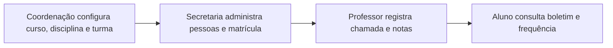

# SGA — Sistema de Gestão Acadêmica

## Escopo da Fase 1

| Metadado | Valor |
| --- | --- |
| Disciplina | Laboratório de Engenharia de Software |
| Professor responsável | Rodrigo Salgado |
| Integrantes do grupo | Andrey Kerges Nascimento, Alexandre Hesse, Max Iago Villafan, João Luiz, Vitor Augusto |
| Versão | **1.0 — MVP Fase 1 concluído** |
| Data | **31 de agosto de 2026** |
| Produto | SGA — Sistema de Gestão Acadêmica |

O SGA é um monólito web para ensino superior. A Fase 1 entrega o ciclo acadêmico essencial: configurar a oferta, administrar contas e matrículas, registrar frequência e notas e permitir a consulta individual pelo aluno.

## Fase 1 concluída

### Perfis e responsabilidades

| Perfil | Responsabilidade entregue |
| --- | --- |
| `ALUNO` | Consulta exclusivamente as próprias matrículas, boletim, médias, situação e frequência. |
| `PROFESSOR` | Consulta suas turmas ativas, registra chamada completa e lança notas nelas. |
| `SECRETARIA` | Cria, edita, lista, ativa/inativa Alunos e Professores; administra matrículas e seus status. |
| `COORDENACAO` | Gerencia cursos, disciplinas e turmas, inclusive alocação de professor. |

### Capacidades do MVP

- Autenticação por sessão, RBAC e troca obrigatória de senha inicial.
- Cursos, disciplinas, turmas, professor responsável, sala, horários e vagas.
- Matrícula administrativa, controle de capacidade, alteração para `TRANCADA`, `CANCELADA` ou `CONCLUIDA` e retentativa somente em outra turma/período.
- Chamada por turma e data, frequência calculada, P1, P2, Trabalho, Exame e situação acadêmica calculada.
- Auditoria imutável de criação e edição de `Nota` e `Falta`.
- Testes automatizados e CI em SQLite e PostgreSQL 16.

## Limites explícitos

Os seguintes itens **não** fazem parte do MVP da Fase 1: auto-matrícula, recuperação de senha, materiais, calendário, comunicados, documentos, transferências, financeiro, aplicativo mobile, integrações externas e pré-requisitos entre disciplinas.

## Roadmap

Esses itens podem ser priorizados em fases futuras, mas não são requisito, entidade, fluxo pronto ou critério de aceite da Fase 1. A evolução deve preservar as entidades e regras já entregues, em especial o histórico de tentativas por turma.

## Documentos relacionados

- [Regras de negócio](SGA-02-REGRAS-DE-NEGOCIO.md)
- [Requisitos](SGA-03-REQUISITOS.md)
- [Modelo de dados](SGA-04-MODELAGEM-DADOS.md)
- [Casos de uso](SGA-06-CASOS-DE-USO.md)
