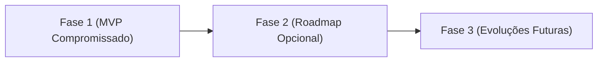

# SGA — Sistema de Gestão Acadêmica

## 📋 Documento de Escopo do Projeto

| Metadado | Detalhe |
| :--- | :--- |
| **Disciplina** | Laboratório de Engenharia de Software |
| **Professor Responsável** | Rodrigo Salgado |
| **Integrantes do Grupo** | Andrey Kerges Nascimento, Alexandre Hesse, Max Iago Villafan, João Luiz, Vitor Augusto |
| **Versão** | `1.0` (MVP da Fase 1) |
| **Data** | Agosto / 2026 |

---

## 🎯 Decisão de Domínio

O grupo definiu que o **SGA** atenderá uma instituição de ensino superior. Essa decisão definiu a estrutura central do sistema:

* **Matrícula Administrativa:** A Secretaria vincula o aluno a turmas de disciplinas específicas por período letivo.
* **Conceito de Turma:** Passa a significar a **oferta de uma disciplina em um período letivo** (ex.: *Programação Orientada a Objetos — 2026/1 — Turma A*), com professor, horário, sala e limite de vagas próprios.
* **Perfis de Usuário:** Não há perfil de Responsável/Pais, uma vez que o público-alvo é adulto.

---

## 1. Visão Geral do Escopo

O projeto consiste no desenvolvimento da **Secretaria Inteligente para Instituições de Ensino Superior (SGA)**, uma aplicação web monólito que centraliza a gestão administrativa e pedagógica da instituição.

> [!NOTE]
> O sistema atende quatro perfis de usuário — **Aluno**, **Professor**, **Secretaria** e **Coordenação de Curso** —, utilizando **RBAC (Role-Based Access Control)** para garantir isolamento e segurança dos dados.

---

## 2. Objetivos do Projeto

### 2.1 Objetivo Geral
Desenvolver uma aplicação web responsiva que permita a gestão de cursos, disciplinas, turmas, professores, alunos, matrículas, notas e frequência, respeitando o perfil de acesso de cada usuário.

### 2.2 Objetivos Específicos
* Permitir que o aluno consulte as próprias matrículas, notas, faltas e situação por disciplina.
* Permitir que o professor registre faltas e notas somente nas turmas em que leciona.
* Permitir que a Secretaria administre alunos, professores e matrículas.
* Permitir que a Coordenação administre cursos e disciplinas, abra turmas e aloque professores.
* Garantir segurança e isolamento de dados por perfil (RBAC), com atenção às normas da LGPD.

---

## 3. Delimitação por Fases

### 3.1 Dentro do Escopo — Fase 1 (MVP Acadêmico Essential)

> [!IMPORTANT]
> A **Fase 1** é o **único escopo obrigatoriamente comprometido** para a entrega do projeto.

#### 👤 Módulo Aluno
* Login e autenticação por e-mail e senha.
* Consulta de notas, faltas e situação por disciplina.
* Visualização da lista de turmas em que está matriculado.

#### 👨‍🏫 Módulo Professor
* Login e autenticação.
* Visualização das turmas em que está formalmente alocado.
* Lançamento e edição de notas (P1, P2, Trabalho, Exame Final).
* Registro de chamadas (presenças e faltas por aula/data).
* Consulta da lista de alunos matriculados em suas turmas.

#### 🏢 Módulo Secretaria
* Login e autenticação.
* Cadastro e inativação de Alunos.
* CRUD administrativo de Professores.
* Matrícula administrativa de alunos em turmas, com preservação de tentativas inativas.

#### 🎓 Módulo Coordenação de Curso
* Login e autenticação.
* CRUD de Cursos.
* CRUD de Disciplinas vinculadas diretamente ao Curso.
* Abertura de Turmas (período letivo, sala, horário e limite máximo de vagas).
* Alocação de professores às turmas ofertadas.

#### ⚙️ Recursos Transversais & Regras
* Autenticação e autorização RBAC por perfil.
* Troca obrigatória de senha no primeiro acesso (`must_change_password`).
* Controle automático de vagas (bloqueio quando `vagas_ocupadas >= vagas_maximas`).
* Cálculo derivado de médias, frequência e situação acadêmica.
* Auditoria básica de alterações em notas e faltas (registro de responsável e data/hora).

---

### 3.2 Roadmap Opcional — Fase 2

> [!TIP]
> Funcionalidades da **Fase 2** compõem uma visão de evolução e **não impedem a conclusão do MVP**.

* **Materiais Didáticos:** Upload e download de arquivos (PDF, DOCX, PPTX) e links para turmas.
* **Calendário Acadêmico:** Cadastro de eventos institucionais, feriados e período de provas.
* **Comunicados / Mural:** Publicação de avisos segmentados por perfil ou curso.
* **Horário Consolidado:** Grade semanal visual de aulas do aluno.
* **Recuperação de Senha:** Envio de link de redefinição por e-mail.
* **Transferência Simplificada:** Registro de entrada/saída com instituição de origem/destino e data.
* **Documentos Cadastrais:** Anexo de RG, CPF, histórico do ensino médio e comprovante de residência.

---

### 3.3 Roadmap Opcional — Fase 3

> [!WARNING]
> Funcionalidades complexas reservadas para expansão futura do sistema.

* **Pré-requisitos:** Bloqueio automático de matrícula caso o aluno não tenha concluído a disciplina pré-requisito.
* **Cancelamento por Autoatendimento:** Cancelamento de disciplina efetuado diretamente pelo aluno.
* **Emissão de Documentos Oficiais:** Geração de Histórico Escolar, Declaração de Matrícula e Atestados formatados.
* **Módulo Financeiro:** Gestão de mensalidades, boletos e inadimplência.
* **Aplicativo Mobile & Integrações:** App nativo iOS/Android e integração com sistemas externos (MEC, e-MEC).

---

## 4. Critério de Conclusão do MVP

O MVP estará concluído e validado quando o seguinte fluxo ponta a ponta for executado com sucesso:

1. A **Secretaria** cadastra o Aluno e o Professor.
2. A **Coordenação** cadastra o Curso, a Disciplina, abre a Turma e aloca o Professor.
3. A **Secretaria** realiza a matrícula do Aluno na Turma.
4. O **Professor** realiza o lançamento das notas (P1, P2, Trabalho) e o registro das faltas.
5. O **Sistema** calcula a média, a frequência e a situação final do Aluno.
6. O **Aluno** realiza login e visualiza seu boletim e percentual de frequência atualizados.
