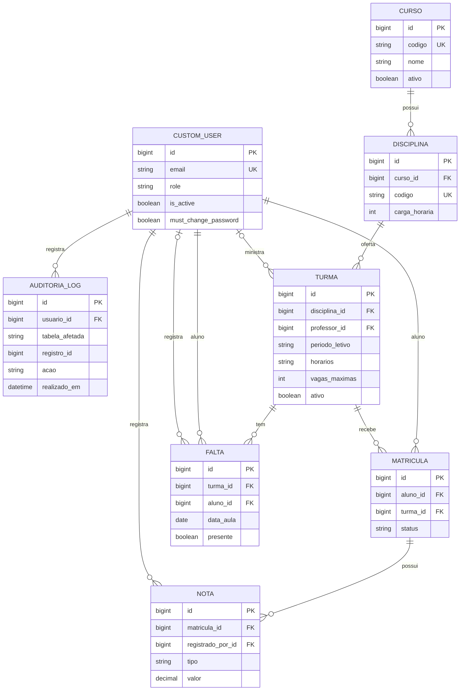

# SGA — Sistema de Gestão Acadêmica

## Modelagem de dados implementada

| Metadado | Valor |
| --- | --- |
| Versão | **1.0 — MVP Fase 1 concluído** |
| Data | **31 de agosto de 2026** |
| SGBD | PostgreSQL 16 via Django ORM |

O modelo possui exatamente as oito entidades abaixo. Aluno e Professor são papéis de `CustomUser`, não perfis ou tabelas separadas.

## Entidades, atributos e restrições

| Entidade | PK e atributos principais | FK, enum e integridade |
| --- | --- | --- |
| `CustomUser` | `id`; `email`, `full_name`, `role`, `is_active`, `must_change_password`, `created_at` | `email` único; `role`: `ALUNO`, `PROFESSOR`, `SECRETARIA`, `COORDENACAO`. |
| `AuditoriaLog` | `id`; `tabela_afetada`, `registro_id`, `acao`, `valor_antigo`, `valor_novo`, `realizado_em` | `usuario_id → CustomUser` (opcional); `acao`: `CRIAR`, `EDITAR`, `EXCLUIR`; inserção preservada e atualização/exclusão bloqueadas. |
| `Curso` | `id`; `nome`, `codigo`, `descricao`, `ativo`, `created_at` | `codigo` único. |
| `Disciplina` | `id`; `nome`, `codigo`, `carga_horaria`, `ativo`, `created_at` | `curso_id → Curso`; `codigo` único. Não existe `GradeCurricular`. |
| `Turma` | `id`; `periodo_letivo`, `horarios`, `sala`, `vagas_maximas`, `ativo`, `created_at` | `disciplina_id → Disciplina`; `professor_id → CustomUser` opcional, limitado ao papel Professor. `horarios` é texto validado. |
| `Matricula` | `id`; `status`, `matriculado_em` | `aluno_id → CustomUser`; `turma_id → Turma`; status: `ATIVA`, `TRANCADA`, `CANCELADA`, `CONCLUIDA`; unicidade condicional de matrícula ativa por Aluno+Turma. |
| `Falta` | `id`; `data_aula`, `presente`, `registrado_em` | `turma_id → Turma`; `aluno_id` e `registrado_por_id → CustomUser`; única por Turma+Aluno+data. |
| `Nota` | `id`; `tipo`, `valor`, `criado_em`, `atualizado_em` | `matricula_id → Matricula`; `registrado_por_id → CustomUser`; `tipo`: `P1`, `P2`, `TRABALHO`, `EXAME`; única por Matrícula+tipo; `0 <= valor <= 10`. |

## Relacionamentos e cardinalidades

## Regras de persistência relevantes

- A restrição de banco permite no máximo uma `Matricula` `ATIVA` por Aluno+Turma. O serviço ainda rejeita qualquer nova tentativa na mesma turma se existir histórico, mesmo inativo.
- A retentativa cria matrícula em outra `Turma`, normalmente outra oferta/período da disciplina; portanto, `Falta` e `Nota` históricas permanecem isoladas.
- `Falta` é diretamente ligada a Aluno, Turma e data, não a `Matricula`.
- `Nota` é ligada a `Matricula`, assegurando a separação entre tentativas.
- Não há entidades atuais para `AlunoPerfil`, `ProfessorPerfil`, `GradeCurricular`, `Horario`, `Trabalho`, materiais, documentos, calendário, financeiro ou transferências.

## Dados calculados, não tabelas

`vagas_ocupadas`, `vagas_disponiveis`, frequência, média parcial (MP), média final (MF) e situação acadêmica são calculados de registros de origem. Não devem ser tratados como campos persistidos ou entidades próprias.

## Referências

- [Regras de negócio](SGA-02-REGRAS-DE-NEGOCIO.md)
- [Casos de uso](SGA-06-CASOS-DE-USO.md)
