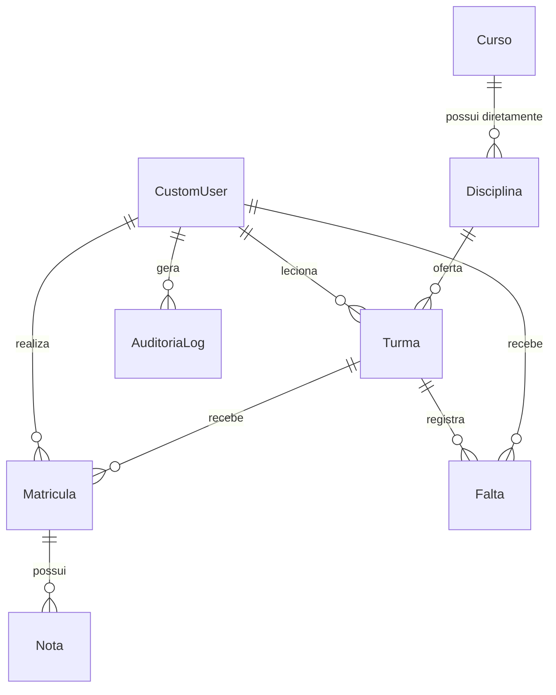

# SGA — Sistema de Gestão Acadêmica

## Modelagem de dados implementada na Fase 1

| Metadado | Detalhe |
| :--- | :--- |
| **Versão** | `1.0` |
| **Referência** | Modelos Django e migrations canônicas do repositório |
| **SGBD** | PostgreSQL 16 via Django ORM |

Este documento descreve o código implementado. Média, frequência, vagas ocupadas e situação acadêmica são valores calculados e não colunas persistidas.

## 1. Entidades

### 1.1 `CustomUser`

É o modelo oficial e único de usuário (`AUTH_USER_MODEL`). Aluno e Professor são papéis do próprio `CustomUser`, não tabelas de perfil separadas.

| Campo | Tipo | Regra |
| :--- | :--- | :--- |
| `email` | `EmailField` único | Login normalizado em minúsculas |
| `full_name` | `CharField(255)` | Nome completo |
| `role` | Enum | `ALUNO`, `PROFESSOR`, `SECRETARIA`, `COORDENACAO` |
| `is_active` | Booleano | Usuário inativo não autentica nem recebe nova matrícula |
| `must_change_password` | Booleano | Força troca de senha no primeiro acesso |
| `created_at` | Data/hora | Registro automático |

### 1.2 `Curso` e `Disciplina`

`Disciplina` possui ligação direta e obrigatória com `Curso` por `Disciplina.curso`. Não existe tabela intermediária de grade curricular no MVP.

| Entidade | Campos principais |
| :--- | :--- |
| `Curso` | `nome`, `codigo` único, `descricao`, `ativo`, `created_at` |
| `Disciplina` | `nome`, `codigo` único, `carga_horaria`, `curso_id`, `ativo`, `created_at` |

### 1.3 `Turma`

Representa a oferta de uma disciplina. Os horários ficam diretamente no campo textual estruturado `Turma.horarios`, por exemplo `SEG 19:00-21:00, QUA 19:00-21:00`.

| Campo | Regra |
| :--- | :--- |
| `disciplina_id` | Disciplina ofertada |
| `periodo_letivo` | Formato `AAAA/1` ou `AAAA/2` |
| `horarios` | Um ou mais intervalos no formato validado pelo domínio |
| `sala` | Local das aulas |
| `vagas_maximas` | Capacidade configurada |
| `professor_id` | `CustomUser` com papel Professor; pode ser nulo durante a preparação |
| `ativo` | Disponibilidade da oferta |

`vagas_ocupadas` e `vagas_disponiveis` são propriedades calculadas a partir de matrículas `ATIVA`.

### 1.4 `Matricula`

Vincula um `CustomUser` Aluno a uma `Turma`. A tentativa acadêmica é preservada mesmo após cancelamento ou trancamento.

| Campo | Regra |
| :--- | :--- |
| `aluno_id` | `CustomUser` com papel Aluno |
| `turma_id` | Turma escolhida pela Secretaria |
| `status` | `ATIVA`, `TRANCADA`, `CONCLUIDA`, `CANCELADA` |
| `matriculado_em` | Registro automático |

Há restrição única condicional para no máximo uma matrícula `ATIVA` por aluno e turma. Matrículas canceladas ou trancadas não bloqueiam uma nova tentativa ativa.

### 1.5 `Nota`

Cada nota pertence à `Matricula`, garantindo isolamento entre tentativas do mesmo aluno.

| Campo | Regra |
| :--- | :--- |
| `matricula_id` | Tentativa acadêmica avaliada |
| `tipo` | `P1`, `P2`, `TRABALHO`, `EXAME` |
| `valor` | Decimal entre `0,00` e `10,00` |
| `registrado_por_id` | Professor responsável |
| `criado_em`, `atualizado_em` | Datas automáticas |

Existe uma única nota por matrícula e tipo. Não há entidade `Avaliacao` separada no MVP.

### 1.6 `Falta`

Registra presença ou ausência por aluno, turma e data de aula. A combinação desses três campos é única. O professor responsável fica registrado em `registrado_por`.

### 1.7 `AuditoriaLog`

Armazena autor, entidade, registro, ação, valor anterior, valor novo e data/hora para alterações em Nota e Falta. O modelo impede atualização e exclusão; suas permissões padrão são apenas adicionar e visualizar.

## 2. Dados derivados

- Média parcial: `(P1 + P2 + Trabalho) / 3`.
- Média final: `(Média parcial + Exame) / 2`.
- Frequência: presenças divididas pelo total de chamadas da matrícula/turma.
- Situação: calculada a partir da completude das notas, médias e frequência.
- Vagas: calculadas contando matrículas ativas.

## 3. Relações do MVP

## 4. Fora da modelagem da Fase 1

Auto-matrícula, materiais, calendário, comunicados, recuperação de senha, transferências, documentos, financeiro, aplicativo mobile, integrações externas e pré-requisitos permanecem no roadmap e não possuem entidades no MVP.
