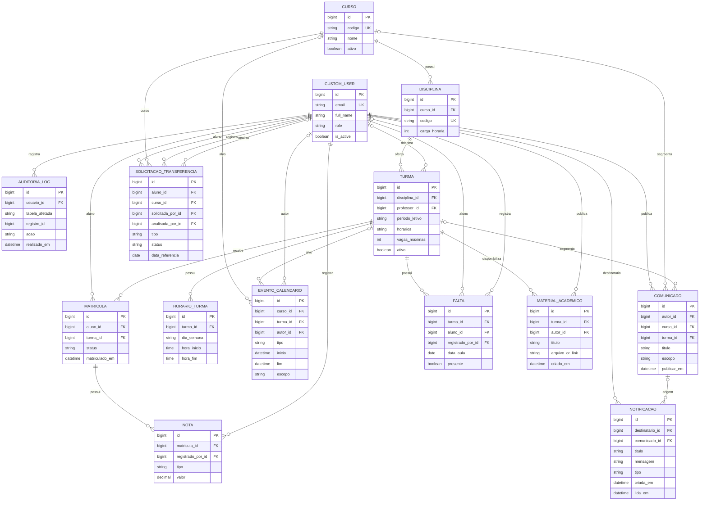

# SGA — Sistema de Gestão Acadêmica

## Modelagem de dados — estado atual

| Metadado | Valor |
| --- | --- |
| Versão | **2.1 — Fase 1 + Fase 2, Semana 4 em revisão** |
| Data | **08 de outubro de 2026** |
| SGBD | PostgreSQL 16 via Django ORM |

O modelo desta entrega possui **14 entidades persistentes**, incluindo o núcleo acadêmico e as extensões da Fase 2. A Semana 4 está implementada nesta branch e aguarda revisão; as demais extensões estão integradas. Aluno e Professor continuam sendo papéis de `CustomUser`, não tabelas separadas. Relatórios não possuem entidade própria: são consultas/seletores sobre os registros existentes.

## Entidades atuais

| Entidade | Papel | Principais relações |
| --- | --- | --- |
| `CustomUser` | Usuários e RBAC | autoriza ações; relaciona-se a turmas, matrículas, frequência, notas, auditoria, comunicados, materiais e transferências |
| `AuditoriaLog` | Auditoria imutável | `usuario → CustomUser` |
| `Curso` | Curso acadêmico | possui `Disciplina`; recebe eventos, comunicados e transferências |
| `Disciplina` | Componente curricular | pertence a `Curso`; possui `Turma` |
| `Turma` | Oferta acadêmica | pertence a `Disciplina`; possui professor, horários, matrículas, faltas, materiais, comunicados e eventos |
| `HorarioTurma` | Grade estruturada | pertence a `Turma`; único por turma/dia/início/fim |
| `EventoCalendario` | Calendário | pode apontar para Curso/Turma e papel de destino; possui autor |
| `Matricula` | Tentativa acadêmica | liga Aluno a Turma; preserva histórico por tentativa |
| `Falta` | Frequência | liga Aluno, Turma, data e registrador |
| `Nota` | Avaliação | pertence a `Matricula`; possui tipo e registrador |
| `MaterialAcademico` | Material | pertence a Turma e possui autor; arquivo ou link |
| `Comunicado` | Comunicação | possui autor e escopo geral, papel, curso ou turma |
| `SolicitacaoTransferencia` | Transferência administrativa | liga Aluno e Curso; registra tipo, instituição/curso externos, decisão e auditoria da análise |

| `Notificacao` | Central pessoal | destinatário `CustomUser`, comunicado opcional, categoria, título, mensagem, criação e `lida_em` |

## MER atual

```mermaid
erDiagram
    CUSTOM_USER ||--o{ AUDITORIA_LOG : registra
    CUSTOM_USER ||--o{ NOTIFICACAO : destinatario
    COMUNICADO o|--o{ NOTIFICACAO : origem
    CURSO ||--o{ DISCIPLINA : possui
    DISCIPLINA ||--o{ TURMA : oferta
    CUSTOM_USER o|--o{ TURMA : ministra
    TURMA ||--o{ HORARIO_TURMA : possui
    CURSO o|--o{ EVENTO_CALENDARIO : alvo
    TURMA o|--o{ EVENTO_CALENDARIO : alvo
    CUSTOM_USER o|--o{ EVENTO_CALENDARIO : autor
    CUSTOM_USER ||--o{ MATRICULA : aluno
    TURMA ||--o{ MATRICULA : recebe
    TURMA ||--o{ FALTA : possui
    CUSTOM_USER ||--o{ FALTA : aluno
    CUSTOM_USER o|--o{ FALTA : registra
    MATRICULA ||--o{ NOTA : possui
    CUSTOM_USER ||--o{ NOTA : registra
    TURMA ||--o{ MATERIAL_ACADEMICO : disponibiliza
    CUSTOM_USER ||--o{ MATERIAL_ACADEMICO : publica
    CUSTOM_USER ||--o{ COMUNICADO : publica
    CURSO o|--o{ COMUNICADO : segmenta
    TURMA o|--o{ COMUNICADO : segmenta
    CUSTOM_USER ||--o{ SOLICITACAO_TRANSFERENCIA : aluno
    CURSO ||--o{ SOLICITACAO_TRANSFERENCIA : curso
    CUSTOM_USER ||--o{ SOLICITACAO_TRANSFERENCIA : registra
    CUSTOM_USER o|--o{ SOLICITACAO_TRANSFERENCIA : analisa

    CUSTOM_USER { bigint id PK string email UK string full_name string role boolean is_active }
    NOTIFICACAO { bigint id PK bigint destinatario_id FK bigint comunicado_id FK string titulo string mensagem string tipo datetime criada_em datetime lida_em }
    AUDITORIA_LOG { bigint id PK bigint usuario_id FK string tabela_afetada bigint registro_id string acao datetime realizado_em }
    CURSO { bigint id PK string codigo UK string nome boolean ativo }
    DISCIPLINA { bigint id PK bigint curso_id FK string codigo UK int carga_horaria }
    TURMA { bigint id PK bigint disciplina_id FK bigint professor_id FK string periodo_letivo string horarios int vagas_maximas boolean ativo }
    HORARIO_TURMA { bigint id PK bigint turma_id FK string dia_semana time hora_inicio time hora_fim }
    EVENTO_CALENDARIO { bigint id PK bigint curso_id FK bigint turma_id FK bigint autor_id FK string tipo datetime inicio datetime fim string escopo }
    MATRICULA { bigint id PK bigint aluno_id FK bigint turma_id FK string status datetime matriculado_em }
    FALTA { bigint id PK bigint turma_id FK bigint aluno_id FK bigint registrado_por_id FK date data_aula boolean presente }
    NOTA { bigint id PK bigint matricula_id FK bigint registrado_por_id FK string tipo decimal valor }
    MATERIAL_ACADEMICO { bigint id PK bigint turma_id FK bigint autor_id FK string titulo string arquivo_or_link datetime criado_em }
    COMUNICADO { bigint id PK bigint autor_id FK bigint curso_id FK bigint turma_id FK string titulo string escopo datetime publicar_em }
    SOLICITACAO_TRANSFERENCIA { bigint id PK bigint aluno_id FK bigint curso_id FK bigint solicitada_por_id FK bigint analisada_por_id FK string tipo string status date data_referencia }
```

### Decisões importantes do modelo

- `Matricula` é uma entidade porque representa a tentativa específica do aluno em uma turma. Isso mantém notas e frequência isoladas quando existe retentativa.
- `Nota` pertence a `Matricula`, não diretamente ao aluno, justamente para preservar tentativas.
- `Falta` permanece ligada a Aluno + Turma + data, com unicidade por aula; a chamada exige matrícula ativa.
- `HorarioTurma` estrutura a grade, enquanto `Turma.horarios` permanece como campo textual legado/compatibilidade no modelo atual.
- `EventoCalendario` representa eventos gerais ou segmentados por papel, curso ou turma.
- `MaterialAcademico` exige exatamente um arquivo ou link e aplica limite de 20 MB para arquivo.
- `Comunicado` possui escopo explícito e valida que somente o alvo correspondente seja preenchido.
- `SolicitacaoTransferencia` é administrativa. Aprovação/recusa não altera automaticamente matrícula, notas ou frequência.
- Relatórios não têm tabela própria; usam selectors/consultas para evitar duplicação de dados e N+1.

## Integridade e segurança

As FKs históricas e as constraints devem ser interpretadas junto às regras de negócio. O backend aplica RBAC e vínculo com o recurso; esconder botões no template não é mecanismo de segurança. As restrições de unicidade relevantes incluem e-mail, matrícula ativa por Aluno+Turma, nota por Matrícula+tipo, chamada por Turma+Aluno+data e solicitação de transferência pendente equivalente.

A migration `notifications/0001_initial.py` cria `Notificacao`. Há unicidade de
Comunicado+destinatário e índice de destinatário/leitura/criação. Excluir usuário
ou comunicado remove suas notificações por `CASCADE`. Tokens de recuperação são
nativos Django, sem tabela própria. O ERD anterior tinha 13 entidades (estado após
PR #70); esta entrega acrescenta a 14ª entidade, sem alterar as relações acadêmicas.

## Referências

- [Regras de negócio](SGA-02-REGRAS-DE-NEGOCIO.md)
- [Requisitos](SGA-03-REQUISITOS.md)
- [Casos de uso](SGA-06-CASOS-DE-USO.md)
- [Transferências](SGA-09-TRANSFERENCIAS.md)
