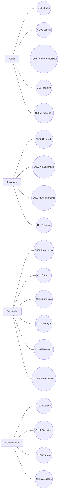

# SGA — Sistema de Gestão Acadêmica

## Casos de uso da Fase 1

| Metadado | Valor |
| --- | --- |
| Versão | **1.0 — MVP Fase 1 concluído** |
| Data | **31 de agosto de 2026** |

## Autenticação e Aluno

| Caso | Ator e pré-condições | Fluxo principal | Exceções | Pós-condições | RN |
| --- | --- | --- | --- | --- | --- |
| **CU01 — Autenticar** | Todos; conta ativa. | Informa e-mail e senha; sistema autentica e abre o painel do papel. | Credencial inválida ou conta inativa é recusada. | Sessão autenticada. | RN01, RN02 |
| **CU02 — Encerrar sessão** | Todos; sessão autenticada. | Envia logout por POST; sistema encerra a sessão e retorna ao login. | Sessão inexistente não concede acesso. | Sessão removida. | RN01 |
| **CU03 — Trocar senha inicial** | Todos; sessão autenticada com flag de primeira senha. | Informa e confirma nova senha; sistema atualiza a senha e remove a flag. | Formulário inválido mantém a exigência. | Acesso ao painel liberado. | RN02 |
| **CU04 — Consultar boletim** | Aluno autenticado com matrículas ativas. | Abre boletim; sistema mostra P1, P2, Trabalho, Exame quando houver, MP, MF e situação das próprias matrículas. | Não há acesso a boletim de outro aluno. | Nenhum dado é alterado. | RN01, RN11–RN14 |
| **CU05 — Consultar frequência** | Aluno autenticado com matrículas ativas. | Abre frequência; sistema calcula aulas, presenças, faltas, percentual e situação por turma. | Não há acesso a dados de outro aluno. | Nenhum dado é alterado. | RN01, RN09–RN11 |

## Professor

| Caso | Ator e pré-condições | Fluxo principal | Exceções | Pós-condições | RN |
| --- | --- | --- | --- | --- | --- |
| **CU06 — Registrar chamada** | Professor; turma ativa sob sua responsabilidade. | Seleciona turma e data; informa presença para todos os alunos ativos; sistema cria/edita a chamada e a audita. | Turma alheia/inativa ou lista incompleta/excedente é rejeitada. | Uma `Falta` por aluno e data; auditoria quando houver mudança. | RN01, RN09, RN10, RN15 |
| **CU07 — Lançar notas parciais** | Professor; turma própria ativa; matrículas ativas. | Informa P1, P2 e/ou Trabalho em lote; sistema valida e salva notas, calculando situação sob demanda. | Nota fora de 0–10, matrícula alheia/inativa ou turma alheia é rejeitada. | Uma `Nota` por matrícula e tipo, com auditoria de mudança. | RN01, RN12, RN15, RN16 |
| **CU08 — Consultar alunos da turma** | Professor; turma própria ativa. | Abre a turma em chamada ou notas e visualiza seus alunos com matrícula ativa. | Turma não atribuída é negada. | Nenhum dado é alterado. | RN01, RN07 |

## Secretaria

| Caso | Ator e pré-condições | Fluxo principal | Exceções | Pós-condições | RN |
| --- | --- | --- | --- | --- | --- |
| **CU09 — Administrar Professores** | Secretaria autenticada. | Cria, edita, lista, ativa ou inativa conta de Professor. | Não edita/inativa a si, Secretaria ou Coordenação. | Conta de Professor atualizada sem alterar credenciais e papel indevidamente. | RN01–RN03 |
| **CU10 — Administrar Alunos** | Secretaria autenticada. | Cria, edita, lista, ativa ou inativa conta de Aluno. | Não edita/inativa a si, Secretaria ou Coordenação. | Conta de Aluno atualizada; inativação preserva histórico. | RN01–RN03 |
| **CU11 — Efetivar matrícula** | Secretaria; Aluno ativo; Turma apta. | Seleciona aluno e turma; sistema valida capacidade, professor, sala, horários e duplicidade; cria matrícula ativa. | Sem vaga, turma incompleta/inativa, aluno inativo ou tentativa na mesma turma é rejeitada. | Nova `Matricula` `ATIVA`. | RN05–RN08, RN16 |
| **CU12 — Alterar situação** | Secretaria; matrícula ativa. | Seleciona `TRANCADA`, `CANCELADA` ou `CONCLUIDA`; sistema atualiza o status. | Status de origem não ativo ou destino inválido é rejeitado. | Matrícula deixa de ser ativa. | RN07, RN16 |

## Coordenação

| Caso | Ator e pré-condições | Fluxo principal | Exceções | Pós-condições | RN |
| --- | --- | --- | --- | --- | --- |
| **CU13 — Gerenciar cursos** | Coordenação autenticada. | Cria, edita ou inativa curso. | Outro papel é negado; dados inválidos não salvam. | `Curso` atualizado. | RN01, RN04 |
| **CU14 — Gerenciar disciplinas** | Coordenação; curso existente. | Cria, edita ou inativa disciplina vinculada diretamente ao curso. | Código duplicado ou dados inválidos são rejeitados. | `Disciplina` atualizada. | RN01, RN04 |
| **CU15 — Gerenciar turmas** | Coordenação; disciplina existente. | Cria, edita ou inativa oferta com período, horários, sala e vagas. | Horário textual inválido ou conflito de professor é rejeitado. | `Turma` atualizada; só ficará apta a matrícula quando completa. | RN01, RN04, RN05 |
| **CU16 — Alocar professor** | Coordenação; turma e Professor existentes. | Atualiza a turma com Professor responsável. | Papel inválido ou conflito de horário é rejeitado. | Turma pode se tornar apta à matrícula se os demais dados existirem. | RN01, RN04, RN05 |

## Conclusão acadêmica e histórico

| Caso | Ator e pré-condições | Fluxo principal | Exceções | Pós-condições | RN |
| --- | --- | --- | --- | --- | --- |
| **CU17 — Lançar Exame** | Professor; turma própria ativa; MP entre 4 e 6 e frequência >= 75%. | Informa Exame para a matrícula elegível; sistema salva, calcula MF e audita. | MP fora da faixa ou frequência baixa bloqueia o lançamento. | Situação é atualizada sob demanda por MF. | RN11, RN13–RN16 |
| **CU18 — Registrar retentativa** | Secretaria; aluno com tentativa anterior. | Seleciona outra turma/oferta, normalmente em novo período; sistema cria a nova matrícula se válida. | A mesma turma é rejeitada, mesmo com matrícula anterior inativa. | Histórico, faltas e notas anteriores permanecem isolados; nova turma inicia sem frequência. | RN05–RN08, RN16 |
| **CU19 — Cancelar matrícula/status** | Secretaria; matrícula ativa. | Seleciona cancelamento, trancamento ou conclusão na gestão de matrícula. | Não altera matrícula já inativa nem reativa status por esse fluxo. | Status da matrícula é preservado para histórico. | RN07, RN16 |

## Referências

- [Regras de negócio](SGA-02-REGRAS-DE-NEGOCIO.md)
- [Rastreabilidade](SGA-05-RASTREABILIDADE.md)
