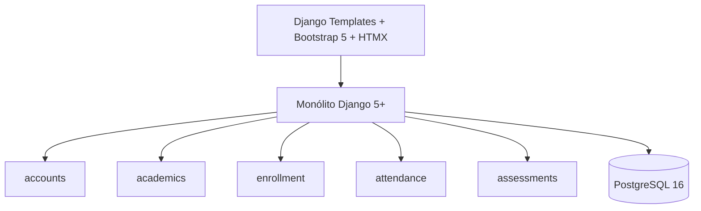
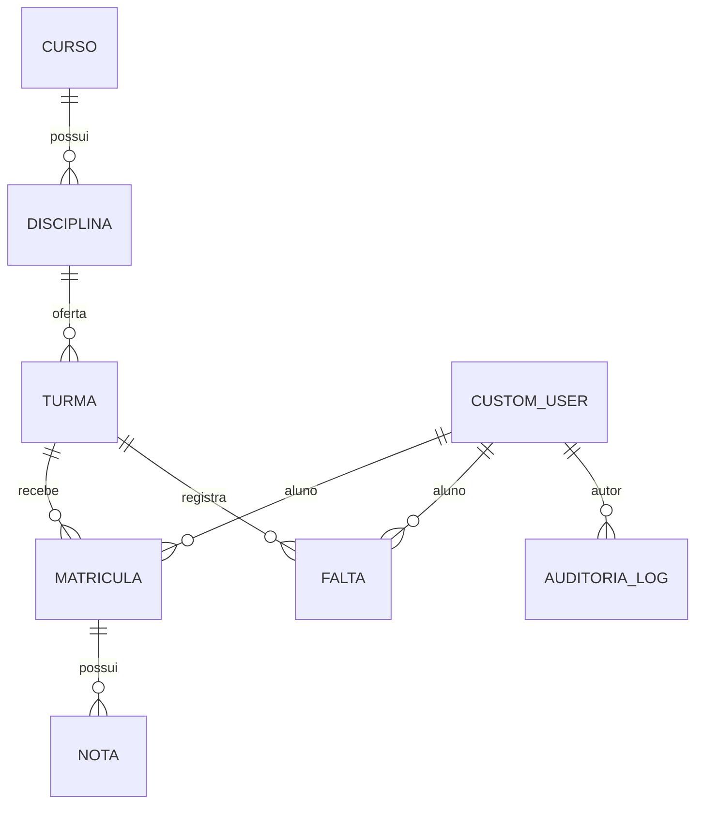

# SGA — Sistema de Gestão Acadêmica

## Documento consolidado

| Metadado | Valor |
| --- | --- |
| Versão | **1.0 — MVP Fase 1 concluído** |
| Data | **31 de agosto de 2026** |

## Resumo

O SGA é um monólito Django para ensino superior. A Fase 1 entrega a gestão acadêmica mínima: RBAC, usuários, oferta acadêmica, matrícula administrativa, frequência, notas, cálculos e consulta individual do aluno. A documentação individual é a referência detalhada; este documento reúne a visão de entrega.

## Escopo e arquitetura



Os módulos correspondem a autenticação/auditoria, oferta acadêmica, matrícula, frequência e avaliações. Regras de negócio ficam em serviços, consultas reutilizáveis em selectors e permissões em decorators/mixins. A aplicação usa Docker Compose e Pytest.

## Perfis

| Papel | Entrega |
| --- | --- |
| `ALUNO` | Boletim, situação e frequência próprios. |
| `PROFESSOR` | Turmas próprias, chamada completa, notas parciais e exame elegível. |
| `SECRETARIA` | Usuários Aluno/Professor, matrícula e status. |
| `COORDENACAO` | Cursos, disciplinas, turmas e alocação docente. |

## Requisitos e regras centrais

Os requisitos implementados são RF01–RF04, RF06–RF07, RF10–RF11, RF13–RF17, RF20–RF23 e RF27–RF35; detalhes e estado estão em [SGA-03](SGA-03-REQUISITOS.md). A matriz completa é [SGA-05](SGA-05-RASTREABILIDADE.md).

```text
MP = (P1 + P2 + Trabalho) / 3
MP >= 6            => aprovado direto
4 <= MP < 6        => elegível ao exame, se frequência >= 75%
MP < 4             => reprovado por nota
MF = (MP + Exame) / 2; MF >= 6 => aprovado após exame
Frequência < 75%   => reprovado por falta e exame bloqueado
```

Somente a Secretaria efetiva matrícula. A matrícula ativa pode ser trancada, cancelada ou concluída. Nova tentativa não é permitida na mesma turma; é criada em outra turma/período, para manter notas e frequência históricas isoladas. Alterações de Nota e Falta são auditadas em log imutável.

## Modelo de dados e ERD

As entidades reais são `CustomUser`, `AuditoriaLog`, `Curso`, `Disciplina`, `Turma`, `Matricula`, `Falta` e `Nota`.



`Disciplina` pertence diretamente a `Curso`; horários são texto validado em `Turma.horarios`; `Nota` pertence a `Matricula`; e `Falta` pertence a Aluno, Turma e data. E-mail, matrícula ativa, nota por tipo e chamada por data possuem as restrições de unicidade descritas em [SGA-04](SGA-04-MODELAGEM-DADOS.md). Média, situação, frequência e vagas são calculadas, não tabelas.

## Casos de uso

Os 19 casos de uso abrangem autenticação (CU01–CU03), Aluno (CU04–CU05), Professor (CU06–CU08 e CU17), Secretaria (CU09–CU12, CU18–CU19) e Coordenação (CU13–CU16). Pré-condições, fluxos, exceções e RN estão em [SGA-06](SGA-06-CASOS-DE-USO.md).

## Testes, CI e demonstração

O projeto possui suíte automatizada para regras acadêmicas, permissões, modelos, serviços, views, seed e fluxo de MVP. A CI executa `check`, verificação de migrations e `pytest` em SQLite e PostgreSQL 16. Para preparar a demonstração, use `docker compose exec web python manage.py seed_demo`; o roteiro e checklist estão em [SGA-07](SGA-07-ROTEIRO-DEMO-E-ENTREGA.md).

## MVP versus Roadmap

Fazem parte do MVP: autenticação, quatro papéis, usuários, cursos, disciplinas, turmas, matrícula administrativa, vagas, frequência, notas, exame, boletim, cálculos e auditoria.

Ficam fora: auto-matrícula, recuperação de senha, materiais, calendário, comunicados, documentos, transferências, financeiro, app mobile, integrações e pré-requisitos.

## Documentos individuais

- [SGA-01 — Escopo](SGA-01-ESCOPO.md)
- [SGA-02 — Regras de negócio](SGA-02-REGRAS-DE-NEGOCIO.md)
- [SGA-03 — Requisitos](SGA-03-REQUISITOS.md)
- [SGA-04 — Modelagem de dados](SGA-04-MODELAGEM-DADOS.md)
- [SGA-05 — Rastreabilidade](SGA-05-RASTREABILIDADE.md)
- [SGA-06 — Casos de uso](SGA-06-CASOS-DE-USO.md)
- [SGA-07 — Roteiro de demonstração](SGA-07-ROTEIRO-DEMO-E-ENTREGA.md)
