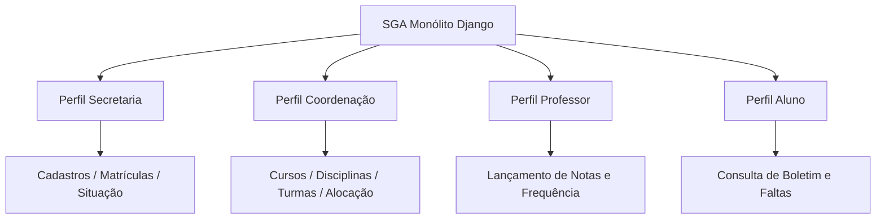
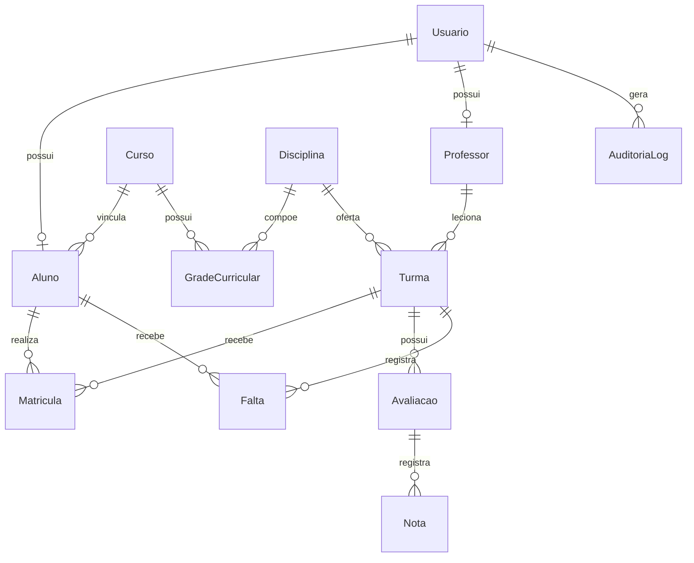

# SGA — Sistema de Gestão Acadêmica

## 📘 Documento Consolidado de Especificação e Arquitetura

| Metadado | Detalhe |
| :--- | :--- |
| **Projeto** | SGA — Sistema de Gestão Acadêmica |
| **Disciplina** | Laboratório de Engenharia de Software |
| **Professor Responsável** | Rodrigo Salgado |
| **Integrantes do Grupo** | Andrey Kerges Nascimento, Alexandre Hesse, Max Iago Villafan, João Luiz, Vitor Augusto |
| **Versão** | `0.4` (Decisões Consolidadas do Grupo) |
| **Data** | Agosto / 2026 |

---

## 📋 Como Usar Este Documento

Este documento reúne todas as especificações do projeto: **escopo**, **regras de negócio**, **requisitos funcionais e não funcionais**, **modelagem de dados** e **rastreabilidade**.

> [!NOTE]
> * Se você concorda com os pontos, não é necessária nenhuma ação.
> * Se tiver contrapropostas, utilize a seção **Registro de Discussão do Grupo** no final deste documento.
> * A **Fase 1 (MVP)** é o único escopo compromissado de desenvolvimento.

---

## ✅ Resumo Executivo — Decisões Já Tomadas

| # | Decisão | Detalhamento |
| :---: | :--- | :--- |
| **1** | **Nome do Projeto** | SGA — Sistema de Gestão Acadêmica. |
| **2** | **Domínio** | Instituição de Ensino Superior (baseado no SIGA Fatec). |
| **3** | **Perfis de Usuário** | 4 perfis: `ALUNO`, `PROFESSOR`, `SECRETARIA`, `COORDENACAO`. Sem perfil de Responsável/Pais. |
| **4** | **Separação de Papéis** | Secretaria (Administrativo) e Coordenação (Pedagógico) são perfis distintos. |
| **5** | **Conceito de Turma** | Oferta de disciplina em período letivo especificando professor, sala, horário e limite de vagas. |
| **6** | **Matrícula no MVP** | Realizada exclusivamente pela Secretaria no MVP (sem autoatendimento discente). |
| **7** | **Controle de Vagas** | Trava automática impedindo inscrições acima da capacidade da turma. |
| **8** | **Fórmula de Cálculo** | Média Parcial = $(P1 + P2 + \text{Trabalho}) / 3$; Média mínima para aprovação direta = $6,0$. |
| **9** | **Recuperação** | Exame final de recuperação para alunos com Média Parcial entre $4,0$ e $5,9$ e frequência $\ge 75\%$. |
| **10** | **Frequência Mínima** | Exigência mínima de **75%** de presença. Frequência menor gera reprovação por falta. |
| **11** | **Sem Pré-Requisitos** | Pré-requisitos entre disciplinas desativados no MVP (reservados para Fase 3). |
| **12** | **Emissão de Documentos** | Histórico oficial e atestados declaratórios ficam fora do MVP (Fase 3). |

---

## 🎯 1. Escopo do Projeto

### 1.1 Domínio e Visão Geral
O **SGA** é um sistema web monólito desenvolvido para centralizar rotinas administrativas e pedagógicas de uma instituição de ensino superior.

### 1.2 Delimitação por Fases

#### 🟢 Fase 1 — MVP Acadêmico Compromissado
* Autenticação segura por e-mail e senha com suporte a `must_change_password`.
* RBAC com 4 perfis (`ALUNO`, `PROFESSOR`, `SECRETARIA`, `COORDENACAO`).
* CRUD de Alunos, Professores, Cursos e Disciplinas.
* Abertura de Turmas e Alocação Docente pela Coordenação.
* Matrícula administrativa realizada pela Secretaria com controle automático de vagas.
* Lançamento de notas (P1, P2, Trabalho, Exame) e registro de chamadas/faltas pelo Professor.
* Cálculo automático de médias, frequência e situação final.
* Consulta de boletim de notas e faltas pelo Aluno.
* Auditoria imutável de alterações em notas e faltas.

#### 🟡 Fase 2 — Roadmap Opcional
* Upload de materiais de aula pelo Professor.
* Calendário acadêmico e publicação de comunicados no mural.
* Grade semanal consolidada de horários do aluno.
* Recuperação de senha por e-mail.
* Registro de transferências de entrada e saída.
* Upload de documentos cadastrais do aluno.

#### 🔴 Fase 3 — Evoluções Futuras
* Pré-requisitos entre disciplinas.
* Matrícula por autoatendimento discente.
* Emissão de documentos oficiais formatados.
* Módulo financeiro e aplicativo mobile.

---

## 📜 2. Regras de Negócio (RN)

### Perfis e Permissões
* **RN01 `[MVP]`**: Um usuário possui exatamente um perfil: `SECRETARIA`, `COORDENACAO`, `PROFESSOR` ou `ALUNO`.
* **RN02 `[MVP]`**: O Professor só atua nas turmas onde está formalmente alocado.
* **RN03 `[MVP]`**: O Aluno só visualiza dados das turmas onde está matriculado.
* **RN04a `[MVP]`**: A Secretaria não gerencia grade curricular, turmas ou alocações.
* **RN04b `[MVP]`**: A Coordenação não cadastra usuários ou executa matrículas.

### Estrutura Acadêmica e Turmas
* **RN05 `[MVP]`**: Cursos possuem disciplinas organizadas em grade curricular.
* **RN06 `[MVP]`**: Aluno é vinculado a um curso, matriculando-se em turmas específicas a cada período.
* **RN07 `[MVP]`**: Turma é a oferta de uma disciplina em determinado período letivo com limites de vaga, horário e sala.
* **RN08 `[MVP]`**: Cada turma possui um professor responsável alocado pela Coordenação.
* **RN09 `[MVP]`**: Proibido conflito de horário de aulas para o mesmo professor no mesmo dia/hora.
* **RN40 `[MVP]`**: Turma pode ser criada sem professor, mas só fica disponível para matrícula após alocação completa.

### Matrículas e Vagas
* **RN10 `[MVP]`**: Matrícula bloqueada ao atingir o limite máximo de vagas (`vagas_ocupadas >= vagas_maximas`).
* **RN12 `[MVP]`**: Status de matrícula: `Ativa`, `Trancada`, `Concluída`, `Cancelada`.
* **RN13a `[MVP]`**: Cancelamento de matrícula na turma realizado exclusivamente pela Secretaria no MVP.
* **RN14 `[MVP]`**: Situação institucional do aluno: `Ativo`, `Trancado`, `Transferido`, `Formado`, `Cancelado`.
* **RN15 `[MVP]`**: Alunos `Trancados` ou `Cancelados` não podem ser matriculados em turmas.

### Cálculo de Média e Frequência
* **RN17 `[MVP]`**: Média Parcial calculada por:
  $$\text{Média Parcial} = \frac{P1 + P2 + \text{Trabalho}}{3}$$
* **RN19 `[MVP]`**: Regras de Aprovação:
  * Média Parcial $\ge 6,0$: `Aprovado Direto`.
  * $4,0 \le \text{Média Parcial} < 6,0$: Elegível para `Exame Final`.
  * Média Parcial $< 4,0$: `Reprovado por Nota`.
* **RN23 `[MVP]`**: Frequência mínima de **75%**.
* **RN35 `[MVP]`**: Média Final pós-exame:
  $$\text{Média Final} = \frac{\text{Média Parcial} + \text{Nota do Exame}}{2} \ge 6,0$$
* **RN48 `[MVP]`**: Frequência $< 75\%$ resulta em `Reprovado por Falta` e **impede** realização do Exame.

### Auditoria
* **RN30 `[MVP]`**: Registro imutável de alteração em notas e faltas (responsável, dado anterior, novo e data/hora).

---

## 📊 3. Matriz de Requisitos (RF e RNF)

### Requisitos Funcionais do MVP
* **RF01**: Autenticação de usuário via e-mail.
* **RF02**: Logout por requisição POST com CSRF.
* **RF03**: Troca de senha obrigatória no primeiro acesso.
* **RF04**: RBAC protegendo URLs e views.
* **RF06**: Consulta de boletim pelo Aluno.
* **RF07**: Consulta de faltas e frequência pelo Aluno.
* **RF10**: Lançamento de chamadas pelo Professor.
* **RF11**: Lançamento de notas pelo Professor.
* **RF13**: Listagem da lista de chamada do Professor.
* **RF14**: CRUD de Professores pela Secretaria.
* **RF15**: CRUD de Alunos pela Secretaria.
* **RF16**: Matrícula e cancelamento de turma pela Secretaria.
* **RF17**: Alteração de situação do Aluno pela Secretaria.
* **RF20**: CRUD de Cursos pela Coordenação.
* **RF21**: CRUD de Disciplinas e matriz curricular pela Coordenação.
* **RF22**: Abertura de Turmas pela Coordenação.
* **RF23**: Alocação de Professor à Turma pela Coordenação.
* **RF27**: Cálculo automático de médias.
* **RF28**: Cálculo automático de frequência.
* **RF29**: Trava automática de limite de vagas.
* **RF30**: Logs de auditoria de notas e faltas.
* **RF31**: Validação de formulários e campos obrigatórios.
* **RF32**: Lançamento de nota de Exame Final.
* **RF33**: Exibição da situação acadêmica final.

### Requisitos Não Funcionais
* **RNF01**: Web responsivo (Bootstrap 5 + HTMX).
* **RNF02**: Autenticação segura de sessão com cookies HTTPOnly.
* **RNF03**: Hash de senha com padrão seguro Django.
* **RNF04**: Tempo de resposta $< 500\text{ms}$.
* **RNF06**: Monólito limpo com separação em `services.py` e `selectors.py`.
* **RNF10**: Docker Compose (`web` Python 3.12 + `db` PostgreSQL 16).
* **RNF11**: Proteção contra SQL Injection, XSS e Open Redirect.

---

## 🗄️ 4. Modelagem de Dados Resumida

---

## 🔗 5. Rastreabilidade do MVP (RF × RN × Entidade)

| RF | Descrição | Regra de Negócio (RN) | Entidades Relacionadas |
| :---: | :--- | :--- | :--- |
| **RF01/RF02** | Autenticação e Logout | RN01 | `Usuario` |
| **RF03** | Troca Obrigatória de Senha | RN01 | `Usuario` |
| **RF04** | RBAC | RN01, RN02, RN03, RN04a, RN04b | `Usuario` |
| **RF06/RF07** | Consulta Aluno (Notas/Faltas) | RN03, RN17–RN19, RN21–RN23, RN48 | `Aluno`, `Turma`, `Nota`, `Falta` |
| **RF10/RF11** | Lançamento Docente | RN02, RN17–RN22, RN32–RN35 | `Professor`, `Turma`, `Nota`, `Falta` |
| **RF14/RF15** | Cadastros pela Secretaria | RN01, RN04b, RN06 | `Usuario`, `Aluno`, `Professor`, `Curso` |
| **RF16/RF17** | Matrícula e Situação | RN04b, RN10–RN15, RN42 | `Aluno`, `Turma`, `Matricula` |
| **RF20–RF23** | Gestão pela Coordenação | RN04a, RN05, RN07, RN08, RN09, RN40 | `Curso`, `Disciplina`, `Turma`, `Professor` |
| **RF27–RF29** | Regras Automáticas do Sistema | RN10, RN11, RN17, RN18, RN22, RN23 | `Turma`, `Matricula`, `Nota`, `Falta` |
| **RF30** | Auditoria | RN30, RN31 | `AuditoriaLog` |

---

## 📝 Registro de Discussão do Grupo

Use esta seção para registrar propostas de alteração em reuniões do grupo:

| Data | Código do Item | Proposta de Alteração | Autor | Status |
| :---: | :---: | :--- | :---: | :---: |
| 16/08/2026 | Domínio | Confirmação do domínio de Ensino Superior (baseado na Fatec) | Grupo | `Aprovado` |
| 16/08/2026 | RN17/RN19 | Definição das fórmulas de média e critério de exame final | Grupo | `Aprovado` |
| 16/08/2026 | Escopo | Confirmação da Fase 1 como único escopo de entrega comprometido | Grupo | `Aprovado` |
