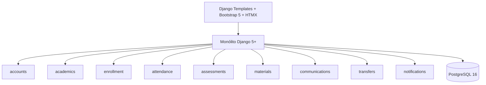
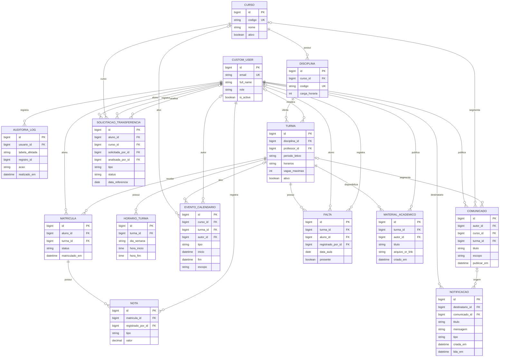

# SGA — Sistema de Gestão Acadêmica

## Documento consolidado

| Metadado | Valor |
| --- | --- |
| Versão | **2.1 — Fase 2 com Semana 4 em revisão** |
| Data | **08 de outubro de 2026** |

## Resumo

O SGA é um monólito Django para ensino superior. A Fase 1/MVP entrega RBAC, usuários, oferta acadêmica, matrícula administrativa, frequência, notas, cálculos e consulta individual do aluno. A Fase 2 adiciona materiais/comunicados, calendário/grade/conflitos, transferências e relatórios acadêmicos. A recuperação segura de senha e as notificações internas estão implementadas nesta entrega, aguardando revisão; a Fase 3 é futura. A documentação individual é a referência detalhada; este documento diferencia as entregas integradas na develop da Semana 4 nesta branch de revisão.

## Escopo e arquitetura


```mermaid
flowchart TB
    UI[Django Templates + Bootstrap 5 + HTMX] --> APP[Monólito Django 5+]
    APP --> ACC[accounts]
    APP --> ACA[academics]
    APP --> ENR[enrollment]
    APP --> ATT[attendance]
    APP --> ASM[assessments]
    APP --> MAT[materials]
    APP --> COM[communications]
    APP --> TRN[transfers]
    APP --> NTF[notifications]
    APP --> DB[(PostgreSQL 16)]
```

Os apps atuais são `accounts`, `academics`, `enrollment`, `attendance`, `assessments`, `materials`, `communications`, `transfers` e `notifications`. Eles cobrem autenticação/recuperação/auditoria e notificações pessoais, oferta e grade acadêmica, matrícula, frequência, avaliações, materiais, comunicados e transferências. Regras de negócio ficam em services, consultas reutilizáveis em selectors e permissões em decorators/mixins. Relatórios são consultas/selectors, sem entidade persistente própria. A aplicação usa Docker Compose e Pytest.

## Perfis

| Papel | Entrega |
| --- | --- |
| `ALUNO` | Boletim, situação e frequência próprios. |
| `PROFESSOR` | Turmas próprias, chamada completa, notas parciais e exame elegível. |
| `SECRETARIA` | Usuários Aluno/Professor, matrícula e status. |
| `COORDENACAO` | Cursos, disciplinas, turmas e alocação docente. |

Na Fase 2, Professor gerencia materiais das próprias turmas; Secretaria e Coordenação participam do fluxo administrativo de transferências conforme permissões; a Coordenação consulta relatórios acadêmicos. Os detalhes estão nos documentos de cada entrega.

## Requisitos e regras centrais

Os requisitos implementados são RF01–RF04, RF06–RF07, RF10–RF11, RF13–RF17, RF20–RF23 e RF27–RF35; detalhes e estado estão em [SGA-03](SGA-03-REQUISITOS.md). A matriz completa é [SGA-05](SGA-05-RASTREABILIDADE.md).

```text
MP = (P1 + P2 + Trabalho) / 3
MP >= 6            => aprovado direto
4 <= MP < 6        => elegível ao exame, se frequência >= 75%
MP < 4             => reprovado por nota
MF = (MP + Exame) / 2; MF >= 6 => aprovado após exame
Frequência < 75%   => reprovado por falta e exame bloqueado
```

Somente a Secretaria efetiva matrícula. A matrícula ativa pode ser trancada, cancelada ou concluída. Nova tentativa não é permitida na mesma turma; é criada em outra turma/período, para manter notas e frequência históricas isoladas. Alterações de Nota e Falta são auditadas em log imutável.

## Modelo de dados e MER atual

O modelo persistente atual possui as 14 entidades listadas em [SGA-04 — Modelagem de dados](SGA-04-MODELAGEM-DADOS.md): `CustomUser`, `AuditoriaLog`, `Curso`, `Disciplina`, `Turma`, `HorarioTurma`, `EventoCalendario`, `Matricula`, `Falta`, `Nota`, `MaterialAcademico`, `Comunicado`, `SolicitacaoTransferencia` e `Notificacao`. Aluno e Professor são papéis de `CustomUser`, não tabelas separadas. Relatórios são consultas e não possuem entidade `Relatorio`.


```mermaid
erDiagram
    CUSTOM_USER ||--o{ AUDITORIA_LOG : registra
    CUSTOM_USER ||--o{ NOTIFICACAO : destinatario
    COMUNICADO o|--o{ NOTIFICACAO : origem
    CURSO ||--o{ DISCIPLINA : possui
    DISCIPLINA ||--o{ TURMA : oferta
    CUSTOM_USER o|--o{ TURMA : ministra
    TURMA ||--o{ HORARIO_TURMA : possui
    CURSO o|--o{ EVENTO_CALENDARIO : alvo
    TURMA o|--o{ EVENTO_CALENDARIO : alvo
    CUSTOM_USER o|--o{ EVENTO_CALENDARIO : autor
    CUSTOM_USER ||--o{ MATRICULA : aluno
    TURMA ||--o{ MATRICULA : recebe
    TURMA ||--o{ FALTA : possui
    CUSTOM_USER ||--o{ FALTA : aluno
    CUSTOM_USER o|--o{ FALTA : registra
    MATRICULA ||--o{ NOTA : possui
    CUSTOM_USER ||--o{ NOTA : registra
    TURMA ||--o{ MATERIAL_ACADEMICO : disponibiliza
    CUSTOM_USER ||--o{ MATERIAL_ACADEMICO : publica
    CUSTOM_USER ||--o{ COMUNICADO : publica
    CURSO o|--o{ COMUNICADO : segmenta
    TURMA o|--o{ COMUNICADO : segmenta
    CUSTOM_USER ||--o{ SOLICITACAO_TRANSFERENCIA : aluno
    CURSO ||--o{ SOLICITACAO_TRANSFERENCIA : curso
    CUSTOM_USER ||--o{ SOLICITACAO_TRANSFERENCIA : registra
    CUSTOM_USER o|--o{ SOLICITACAO_TRANSFERENCIA : analisa

    CUSTOM_USER { bigint id PK string email UK string full_name string role boolean is_active }
    NOTIFICACAO { bigint id PK bigint destinatario_id FK bigint comunicado_id FK string titulo string mensagem string tipo datetime criada_em datetime lida_em }
    AUDITORIA_LOG { bigint id PK bigint usuario_id FK string tabela_afetada bigint registro_id string acao datetime realizado_em }
    CURSO { bigint id PK string codigo UK string nome boolean ativo }
    DISCIPLINA { bigint id PK bigint curso_id FK string codigo UK int carga_horaria }
    TURMA { bigint id PK bigint disciplina_id FK bigint professor_id FK string periodo_letivo string horarios int vagas_maximas boolean ativo }
    HORARIO_TURMA { bigint id PK bigint turma_id FK string dia_semana time hora_inicio time hora_fim }
    EVENTO_CALENDARIO { bigint id PK bigint curso_id FK bigint turma_id FK bigint autor_id FK string tipo datetime inicio datetime fim string escopo }
    MATRICULA { bigint id PK bigint aluno_id FK bigint turma_id FK string status datetime matriculado_em }
    FALTA { bigint id PK bigint turma_id FK bigint aluno_id FK bigint registrado_por_id FK date data_aula boolean presente }
    NOTA { bigint id PK bigint matricula_id FK bigint registrado_por_id FK string tipo decimal valor }
    MATERIAL_ACADEMICO { bigint id PK bigint turma_id FK bigint autor_id FK string titulo string arquivo_or_link datetime criado_em }
    COMUNICADO { bigint id PK bigint autor_id FK bigint curso_id FK bigint turma_id FK string titulo string escopo datetime publicar_em }
    SOLICITACAO_TRANSFERENCIA { bigint id PK bigint aluno_id FK bigint curso_id FK bigint solicitada_por_id FK bigint analisada_por_id FK string tipo string status date data_referencia }
```

`Disciplina` pertence diretamente a `Curso`; `HorarioTurma` estrutura a grade e `Turma.horarios` permanece como campo textual legado/compatibilidade; `Nota` pertence a `Matricula`; `Falta` liga Aluno, Turma e data. `MaterialAcademico`, `Comunicado` e `SolicitacaoTransferencia` persistem as extensões da Fase 2. E-mail, matrícula ativa, nota por tipo, chamada por data e solicitação pendente equivalente possuem as restrições descritas em [SGA-04](SGA-04-MODELAGEM-DADOS.md). Média, situação, frequência, risco acadêmico e vagas são calculados, não tabelas.

## Casos de uso

Os 19 casos de uso abrangem autenticação (CU01–CU03), Aluno (CU04–CU05), Professor (CU06–CU08 e CU17), Secretaria (CU09–CU12, CU18–CU19) e Coordenação (CU13–CU16). Pré-condições, fluxos, exceções e RN estão em [SGA-06](SGA-06-CASOS-DE-USO.md).

## Testes, CI e demonstração

O projeto possui suíte automatizada para regras acadêmicas, permissões, modelos, services, views, seed e fluxos integrados da Fase 2. A CI executa `check`, verificação de migrations e `pytest` em SQLite e PostgreSQL 16. Na validação específica da PR #70 foram registrados **380 testes aprovados, 2 skips de concorrência PostgreSQL e cobertura de 88,75%**; os dois jobs do CI (SQLite e PostgreSQL) passaram. Essa evidência descreve aquela execução da Semana 5, não fixa a contagem/cobertura futura. Para preparar a demonstração, use `docker compose exec web python manage.py seed_demo`; o roteiro e checklist estão em [SGA-07](SGA-07-ROTEIRO-DEMO-E-ENTREGA.md).

Na validação desta implementação da Semana 4 (08/10/2026), a suíte completa no
Docker/Python 3.12 registrou **424 aprovações, 3 skips SQLite e cobertura 89.67%**
(threshold mantido em 85%). A suíte completa PostgreSQL 16 registrou **427
aprovações sem skips**; os 45 testes novos também passaram no Docker/Python 3.12
com PostgreSQL. Checks e migrations passaram nos dois bancos. CI remoto desta
branch aguarda publicação/revisão e não é declarado verde. Os números registram
esta execução; detalhes em [SGA-11](SGA-11-RECUPERACAO-NOTIFICACOES.md).

## Fases e estado atual

### Fase 1/MVP — concluída

Autenticação e quatro papéis, usuários, cursos, disciplinas, turmas, matrícula administrativa, vagas, frequência, notas, exame, boletim, cálculos e auditoria compõem o núcleo original.

### Fase 2 — entregas integradas e implementação da Semana 4

Semanas 1, 2, 3 e 5 integradas; Semana 4 implementada nesta entrega, aguardando revisão.

- Materiais e comunicados — concluídos (PR #66).
- Calendário, grade e conflitos — concluídos (PR #67).
- Relatórios acadêmicos — entregues na PR #68 e complementados na PR #70.
- Transferências — concluídas na PR #69; integração com relatórios concluída na PR #70.
- Recuperação segura de senha — implementada nesta entrega (#35; solicitação #47 e redefinição/token #59).
- Notificações internas, leitura e testes — implementados nesta entrega (#35; central #48 e leitura/testes #60).

### Fase 3 — futura

Planejada para etapa posterior (#37), após estabilização e decisão da equipe. Pré-requisitos/equivalência de créditos, documentos acadêmicos oficiais, financeiro acadêmico, dashboard gerencial e estudos de API pública, integrações, aplicativo mobile e IA não são declarados como entregues neste estado.

“Fora do MVP” identifica o escopo original da Fase 1; não significa que os módulos posteriores implementados na Fase 2 estejam ausentes do código.

## Documentos individuais

- [SGA-01 — Escopo](SGA-01-ESCOPO.md)
- [SGA-02 — Regras de negócio](SGA-02-REGRAS-DE-NEGOCIO.md)
- [SGA-03 — Requisitos](SGA-03-REQUISITOS.md)
- [SGA-04 — Modelagem de dados](SGA-04-MODELAGEM-DADOS.md)
- [SGA-05 — Rastreabilidade](SGA-05-RASTREABILIDADE.md)
- [SGA-06 — Casos de uso](SGA-06-CASOS-DE-USO.md)
- [SGA-07 — Roteiro de demonstração](SGA-07-ROTEIRO-DEMO-E-ENTREGA.md)


## Estado atual — 08 de outubro de 2026

**Fase 1/MVP:** concluída. **Fase 2:** materiais/comunicados, calendário/grade/conflitos, relatórios e transferências integrados; Semana 5 concluída pela PR #70 (`950d871597dea7499bd9e63ca75029639314a97a`). A Semana 4 (#35 e issues relacionadas) está implementada nesta branch, aguardando revisão e integração. **Fase 3:** futura (#37).

Este documento é a visão consolidada para apresentação. Os documentos SGA-01 a SGA-06 permanecem como especificação detalhada do MVP e não devem ser interpretados como inventário exaustivo das extensões posteriores.

## Entrega da Semana 4 — Issue #35 (08/10/2026)

**Estado desta branch:** #35, #47, #48, #59 e #60 concluídas na implementação,
aguardando revisão e integração. Isso não declara merge na develop nem fechamento
das issues no GitHub. A base é `08d4407`; Semanas 1, 2, 3 e 5 permanecem entregues
e Fase 3 permanece futura.

Recuperação usa tokens nativos Django com expiração configurável, validação de
senha, uso único e confirmação serializada no PostgreSQL. A central pessoal tem
paginação, detalhe, leitura individual/todas via POST + CSRF e contador na navbar.
Comunicados, notas e frequência geram notificações conforme as regras existentes.
Detalhes, configuração e evidências: [Semana 4](SGA-11-RECUPERACAO-NOTIFICACOES.md).

**Registro histórico da revisão após PR #70:** naquele ponto, recuperação de senha
e notificações ainda estavam pendentes. A implementação desta entrega é posterior;
o escopo original da Fase 1 e as evidências das PRs anteriores são preservados.
